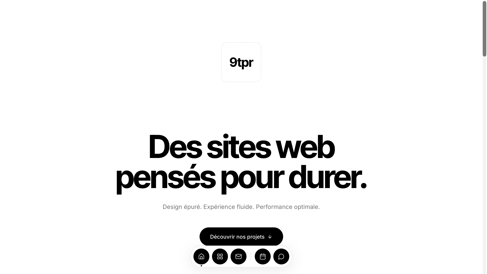

# Merchant Starter Kit

[](LICENSE)


A free and open-source website starter kit for local merchants and small businesses.

## Preview

[](https://9tpr.base44.app/)

## Live Demo

Explore a real business website built using this approach:

**[Visit 9tpr Studio](https://9tpr.base44.app/)**

## About the Project

Many local merchants lack the time, budget, or technical knowledge required to build a modern website.

Merchant Starter Kit provides a simple, responsive, and reusable foundation that developers and business owners can customize for different types of local businesses.

## Features

* Modern and responsive design
* Mobile-friendly layout
* Hero section
* About section
* Services section
* Contact section
* Clear call-to-action buttons
* Easy customization
* Lightweight HTML and CSS
* No framework or complex setup required

## Who Is It For?

This starter kit can be adapted for:

* Restaurants
* Local shops
* Freelancers
* Barbers
* Beauty salons
* Craftspeople
* Consultants
* Other small businesses

## Technologies

* HTML5
* CSS3

## Getting Started

### 1. Clone the repository

```bash
git clone https://github.com/Finn144-ii/merchant-starter-kit.git
```

### 2. Open the project

```bash
cd merchant-starter-kit
```

### 3. Launch the website

Open `index.html` in your web browser.

No installation, build command, or external dependency is required.

## Customization

You can quickly adapt the template to a real business:

1. Replace the business name and text in `index.html`.
2. Update the services and contact information.
3. Change the colors, fonts, and spacing in `style.css`.
4. Add your own images and logo.
5. Publish the customized website using GitHub Pages or another hosting service.

## Project Structure

```text
merchant-starter-kit/
├── 9tpr-home-page.png
├── index.html
├── style.css
├── README.md
└── LICENSE
```

## Roadmap

* [x] Create the initial responsive template
* [x] Add the main business sections
* [x] Publish the project under the MIT License
* [ ] Add reusable color themes
* [ ] Add more business examples
* [ ] Improve accessibility
* [ ] Add a contact form
* [ ] Add multilingual support
* [ ] Create contribution guidelines

## Contributing

Contributions are welcome.

To contribute:

1. Fork the repository.
2. Create a new branch.
3. Make your changes.
4. Open a pull request explaining your improvements.

You can also open an issue to suggest a feature or report a problem.

## Project Goal

The goal of Merchant Starter Kit is to make professional websites more accessible to local businesses while providing developers with a practical and reusable open-source foundation.

## Author

Created by **9tpr Studio**.

* Website: [9tpr.base44.app](https://9tpr.base44.app/)
* GitHub: [Finn144-ii](https://github.com/Finn144-ii)

## License

This project is available under the [MIT License](LICENSE).
